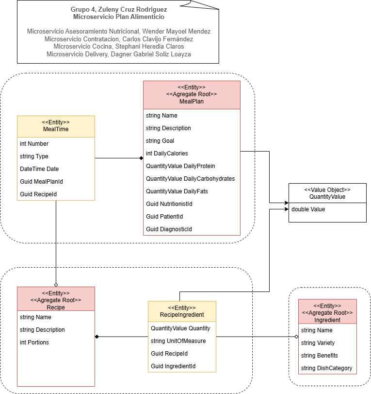

# Microservicio Plan Alimenticio

## Descripción

El microservicio se encarga de la gestión del plan alimenticio del paciente, abarcando tanto las recetas como los ingredientes que lo componen. Su objetivo principal es asegurar que las necesidades nutricionales del paciente se cumplan de forma eficiente y personalizada.

## Funcionalidades

### Gestión de Recetas
- Almacenamiento y actualización de recetas.
- Adaptación de recetas basadas en las necesidades y preferencias del paciente.

### Administración de Ingredientes
- Inventario detallado de ingredientes.
- Información sobre el valor nutricional, origen y disponibilidad de los ingredientes.

### Personalización del Plan Alimenticio
- Creación de planes alimenticios balanceados y personalizados.
- Ajuste de las recetas y planes según las recomendaciones del nutricionista.

